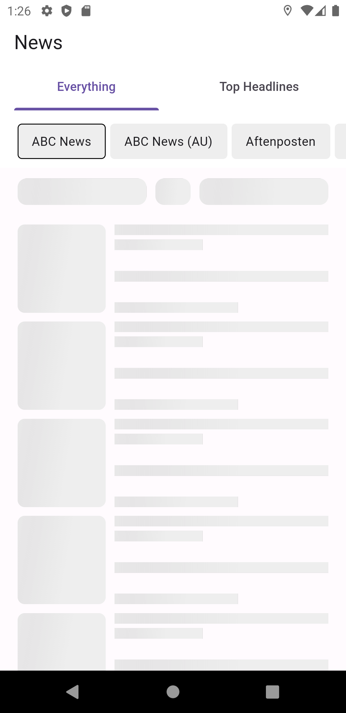
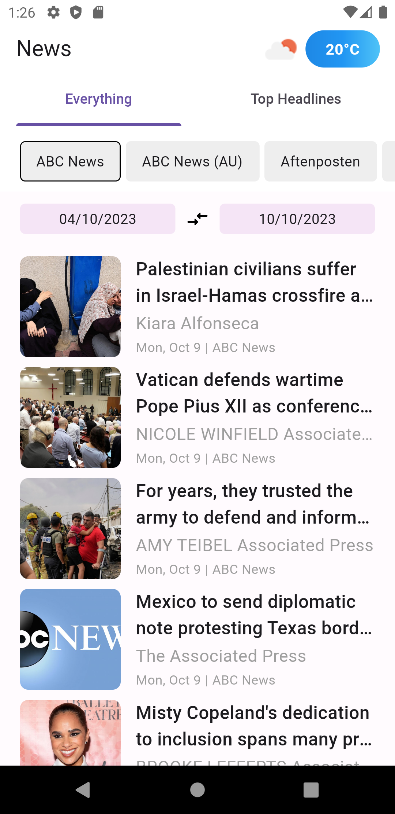
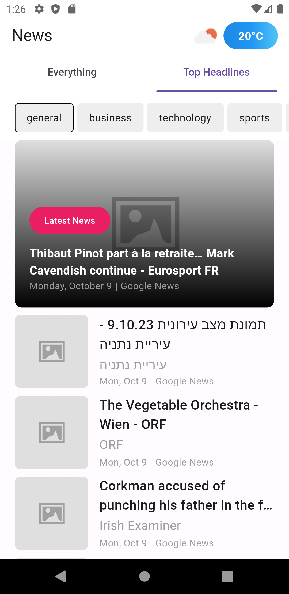

**README**

**Flutter 3.13.6**

This project is a demonstration of how to create a Flutter application using a clean architecture, Bloc, Equatable, and other design patterns and principles.

## FAQ

1. What architecture do you think best fit for this scale of app?

```
I prefer using Clean Architecture across various projects. In this particular project, I'm following an architecture with a Clean Architecture approach. However, depending on the complexity, I might consider using MVVM, MVC, etc. It's crucial to choose an architecture that aligns well with the specific requirements and scalability needs of each project.
```

2. There is no limitation on external library usages.. but where should a dev draw the line of whether code the functionality himself/herself or use external library?

```
While there are numerous packages available in Flutter that facilitate various tasks, I personally prefer to write the necessary code for specific functionalities unless it's strictly necessary, such as when dealing with a service that requires a specific package. This approach allows for better control over the code used in the app. If there's a need to migrate or implement a hotfix, it can be done seamlessly.

Using packages can indeed save you from writing repetitive code and allow you to focus on more features of the app. However, it also makes you dependent on the maintenance and updates of the package by its authors or the community. In any case, if a package is used, it's essential to verify its source and ensure that it undergoes regular maintenance.
```

3. What do you think is the best way to represent the data provided by the apis in the document there?

```
As a frontend developer focused on UI/UX, I believe in keeping things simple. The KISS (Keep It Simple, Stupid) approach has been beneficial in creating simpler and more intuitive interfaces. Simplicity in design helps users better understand and use the application without unnecessary complications. It involves presenting the essential information while showcasing all the functionalities the application offers.
```

4. Use of all endpoints is not necessary but which endpoints do you think is the must have for a news app?

```
As mentioned earlier, simplicity is crucial. Even if there are only three endpoints, the richness can come from various filters and queries that users can apply.

In determining the must-have endpoints, it's important to consider the target audience of the application. This approach helps tailor the functionalities to the specific needs and preferences of the users, ensuring that the app provides relevant and valuable content without overwhelming them.
```

## Considerations

1. You can find an updated APK in the following folder:

```
resources/app-release.apk
```

## Installation

1. Install Flutter by following the instructions in the official documentation: https://flutter.dev/docs/get-started/install.
2. Clone this repository:

```
git clone https://github.com/carrizomiguel/flutter_news_app.git
```

3. Navigate to the project folder:

```
cd flutter_news_app
```

4. Install dependencies:

```
flutter pub get
```

## Execution

To run the application in development mode:

```
flutter run
```

To run the application in production mode:

```
flutter build apk
```

## Screenshots

  

## Architecture

### Project Folder Structure
```
├── lib/
|   ├── core/
|   │   ├── app/
│   │   │   ├── pages/
│   │   │   └── app.dart
|   |   └── core.dart
│   ├── features/
│   │   ├── feature1/
│   │   │   ├── bloc/
│   │   │   ├── pages/
│   │   │   ├── widgets/
│   │   │   └── feature1.dart
│   │   ├── feature2/
│   │   │   ├── bloc/
│   │   │   ├── pages/
│   │   │   ├── widgets/
│   │   │   └── feature2.dart
│   │   └── features.dart
|   ├── bootstrap.dart
│   └── main.dart
├── packages/
|   ├── package1/
│   └── package2/
├── pubspec.yaml
└── README.md
```

## Design Patterns and Principles

The application incorporates the following design patterns and principles:

* **Bloc:** This design pattern helps separate the UI logic from business logic.
* **Equatable:** This mixin assists in efficiently comparing objects.
* **Clean Architecture:** This architectural pattern aids in designing modular and maintainable applications.

## Others

The application also utilizes the following libraries and tools:

* **Dart:** This programming language is used to develop Flutter applications.
* **Flutter:** This SDK is employed to create mobile, web, and desktop applications using Dart.
* **Flutter DevTools:** This toolkit helps debug and profile Flutter applications.